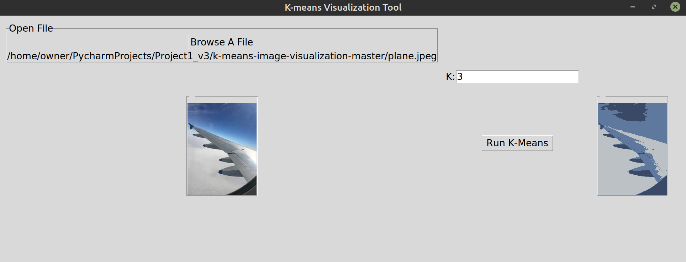

# K-means Clustering Image Visualization
This is a simple tool to help visualize k-means clustering. Many graphics that show k-means display clustering on data points on a plot. Another interesting way to show the results of this algorithm is to perform clustering on pixels in an image, which is what this program does, specifically JPEGs.

## Python Module Dependencies
### NumPy
To install NumPy run `pip install numpy`.
### Sk-learn
To install Sk-learn run `pip install -U scikit-learn`.
### Python Imaging Library
To install PIL run `pip install pillow`.
### image_utils.py
Regardless of the method you choose to run the program, image_utils.py needs to live in the same directory as `run_k_means.py` and/or `gui.py`.
### Pyinstaller (optional)
If you wish to run the gui as an executable file other than a Linux executable, you can freeze the code using the Pyinstaller module. To intall it run `pip install pyinstaller`. Once installed navigate to directory where `gui.py` lives and run `pyinstaller --onefile --hidden-import=scipy._lib.messagestream --hidden-import=sklearn.tree --hidden-import=sklearn.neighbors.typedefs --hidden-import=sklearn.neighbors.quad_tree --hidden-import=sklearn.tree._utils --hidden-import=sklearn.utils._cython_blas --hidden-import=PIL._tkinter_finder --hidden-import=pkg_resources.py2_warn gui.py`. Once finished the executable will be located in the `dist` directory where `gui.py` is.
## How to run
There are two ways to run k-means clustering on an image, `run_k_means.py` and `gui.py`. The first file can be running
`python3 run_k_means.py` in the directory that the file lives. This will give a prompt for the user to enter the file path of the image they wish to perform k-means on, followed by a prompt to name the new image file resulting from k-means clustering (note: if the filepath is not specified for the new file name, the image will be saved in the working directory). The last prompt will ask what value of K to implement. The resulting image will be created some time after the final prompt.
\
\
The second method is by using the gui. This can be done by running `python3 gui.py` in the directory where `gui.py` lives, or by [downloading the Linux executable](https://github.com/BenjaminWSwenson/K-Means-Image-Visualization/releases/tag/V1.0), or by creating your own executable as described above. A window will pop-up with with a button to browse for an image file. Once a file is selected it will be displayed in the window, and a textbox to enter a value for K will appear as well as a button called "Run K-Means". After a value is entered and the button is pressed the resulting image will appear to the right. This method does not save the resulting image
## Optimal Inputs
Firstly all images have to be JPEGs. To have a result delivered in a resonable amount of time, the image should be roughly 300x300 or smaller, and K should be no larger than 5. The example image plane.jpeg is 194x259, with a K of 3 a result image is created in ~13 seconds.
## ToDo
* Create a save file dialog in `gui.py` to save the result image
## Credits
Inspiration for this project is from Prof. Daniel Kluver
